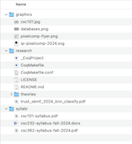

# CSC 101 - Challenge: File Forensics

[](./screenshot.png)

> ***Ack! My files!***...
> 
> I had a folder with all my stuff in it (click the image above to see the screenshot), and my computer crashed while I was in the middle of doing stuff (I think I was trying to create a compressed archive file so I could email everything to myself). Now, all I have is a single corrupted file somehow:

- [crunchtarzg](./crunchtarzg)

### Your task:

Download this file to your Linux OS and figure out how to restore all my files and the directory structure using terminal commands.

You should submit to Canvas a text file containing a list of commands that can be used to restore the directory tree structure and files as shown in the screenshot above. Start with the following commands to create a working folder in your user home directory and download the corrupted file above into it:

```
mkdir ~/ext-activity

cd ~/ext-activity

curl -O https://raw.githubusercontent.com/nadeemabdulhamid/csc101-repo-fall2024/refs/heads/main/ext/crunchtarzg

...
```

## Hints

The following shell commands may be useful. You may look them up in the manual (`man`), or Google, or use other Internet resources as necessary to figure out how to use them.

```
mkdir     --- creates a directory
cd        --- changes the current directory
mv        --- moves or renames a file/directory

tar xvf <filename>      --- extracts the contents of a tar file
gunzip  <filename.gz>   --- extracts a compressed file
hexdump -C -n 100 <filename>  --- shows raw hexadecimal (binary) data
                                  from an arbitrary file, with ASCII 
                                  (text) decoding side-by-side
```


