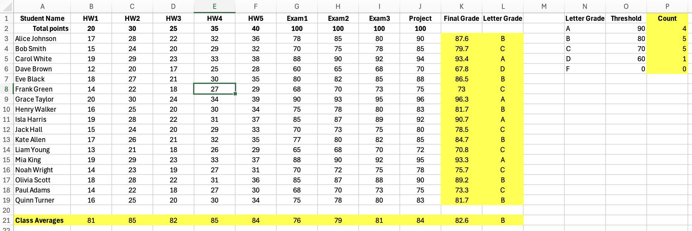
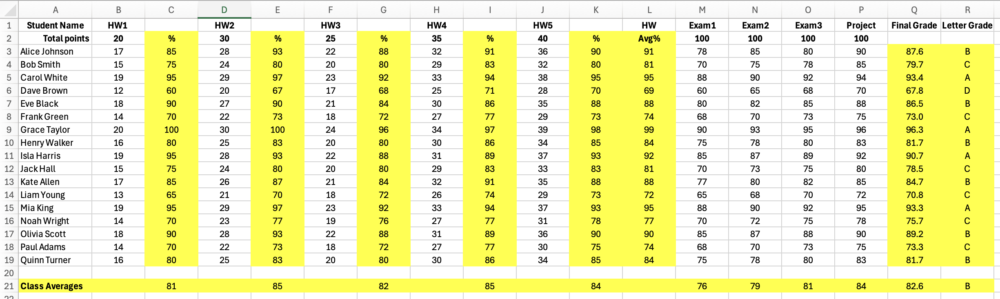

# CSC 101 - Challenge: Excel Spreadsheet Formulae

## Calculating Grades

For this activity, you will add formulas to an Excel spreadsheet to calculate final and average grades for a class of students. 

You are to complete this challenge on your own, but you may ask and share hints on the course Discord channel. You can also use any online resources (including generative AI tools) to work on it. Provide any credits/links on rows near the bottom of your spreadsheet file.

## Requirements 

- In this directory, find and download the file with your name: **[Files](./files/)** and open it in Excel to work with.
- Develop a formula for the "Final Grade" column to calculate students' final grades. There are between 5 and 9 homework columns in your spreadsheet, each out of a variable number of points. For the average homework grade, drop the lowest grade for each student. The homework assignments are worth 50% of the entire grade. The exams are 10% each, and the project is 20%.

    You should have a **single** formula typed into the last column of row 3 in your spreadsheet, which can then be copy/pasted or dragged down to extend to all the other rows automatically. You should not have to write a new/modified formula for each student row.

    You may add additional columns to calculate intermediate results (e.g. to convert each homework grade to its average), like this:

    

- Add a row at the bottom calculating the average class score (percentage) on each assignment.

## [Optional] Additional Skill Challenges

- Add a letter grade threshold mini-table (like in the first screenshot above) (or [this demo spreadsheet](demo-solution-values-only.xlsx)), then add a column that *automatically* fills in a letter grade for each student based on the thresholds. Again, this should be a single formula that is copied down through every row and should work universally. It should automatically adjust the letter grades if the thresholds are edited. 

- Add a column to the letter grade mini-table that counts how many of each letter grade were earned as final grades in the course.

